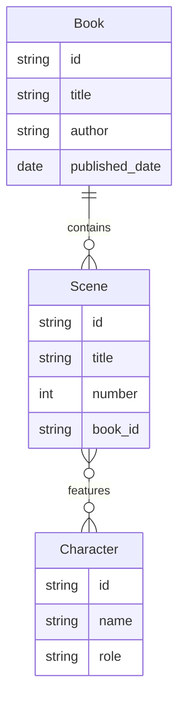

# FireFlake

FireFlake es un gestor de novelas o libros con capacidad para añadir personajes varios, escenas en detalle, seleccionar un personaje protagonista... y en definitiva, crear a través de la estructura basada en el [método Snowflake](https://putifruta.wordpress.com/2015/03/08/escribir-con-el-metodo-snowflake/) una obra de ficción. A través de los pasos especificados, el esqueleto de la novela crece y facilita su escritura.

Con este software se almacenan todos esos pasos especificados hasta que, al final, se generará un fichero de texto rico en el formato a elegir. Solo queda dar rienda suelta a la creatividad y llenar esas páginas que te llevarán hasta el best-seller.

Ejemplo de app: [▶️ vídeo en YouTube](https://youtu.be/5UdYlEhAuTE)

### Proceso evolutivo en el método Snowflake

Los diferentes pasos incluyen:

- 1, el resumen en una sola frase
- 2, ampliación del resulen con actos pricipales y final
- 3, describiendo al protagonista, con los diferentes elementos:

- 4, convitiendo cada frase del paso 2 y convertirlo en un nuevo párrafo
- 5, describir a los personajes pricipales
- 6, volver al punto cuatro y ampliar argumento
- 7, crea tablas de personaje para los principales, siguiendo la estructura del punto tres
- 8, usando el argumento ampliado, escribe una lista de las escenas que faltan para completar la historia
- 9, de cada escena en la lista, escribe un resumen narrativo (con varios párrafos)

¡A escribir!

### Esquema de entidades

---

Se empezaría con [WPF](https://learn.microsoft.com/en-us/dotnet/desktop/wpf) y se experimenta su progreso en [Flutter](https://flutter.dev/).